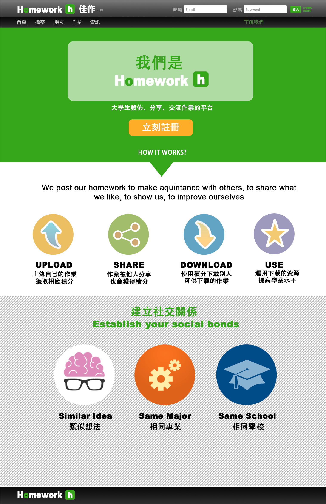
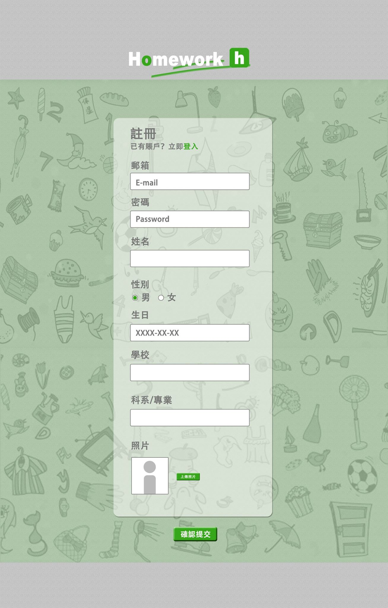
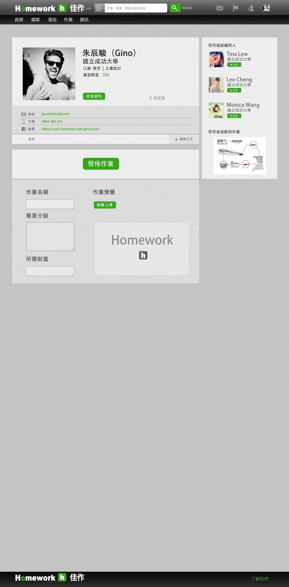
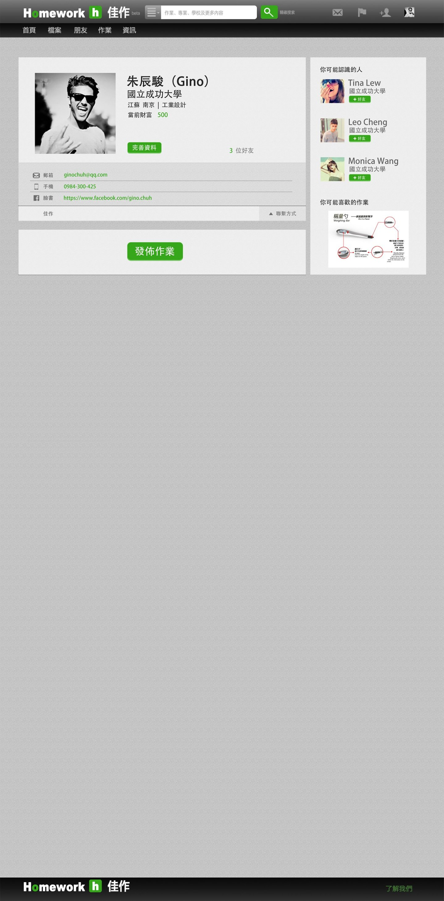
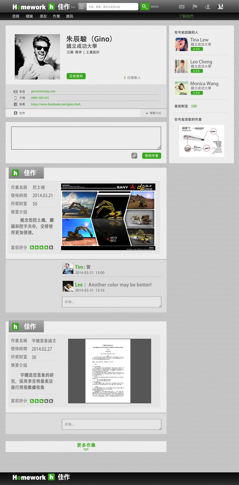
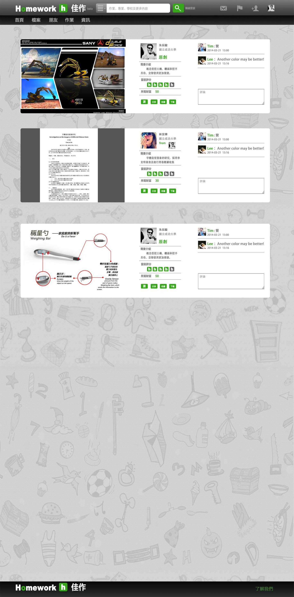
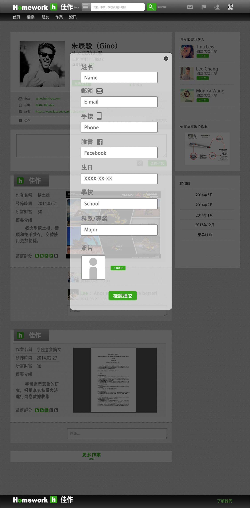

# Homework Sharing 
Homework sharing is a student done in course “Web Programming” given by Prof. Chang Tien-Hao at NCKU. It is a social platforms for students to exchange their notes, homework or publications

